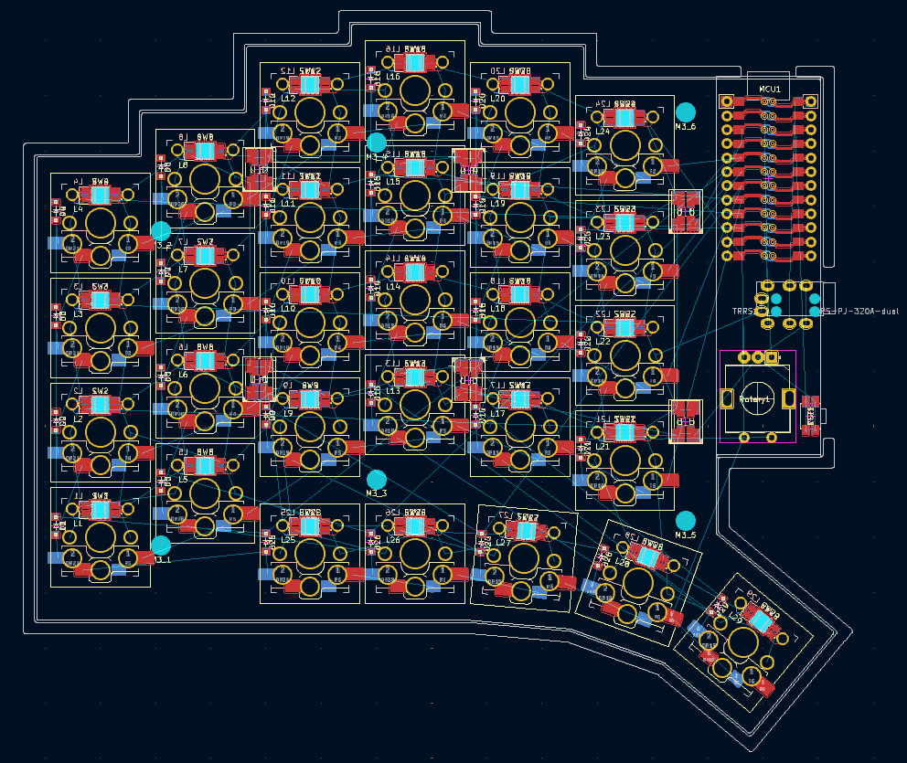
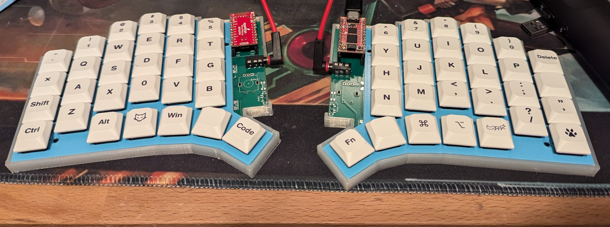
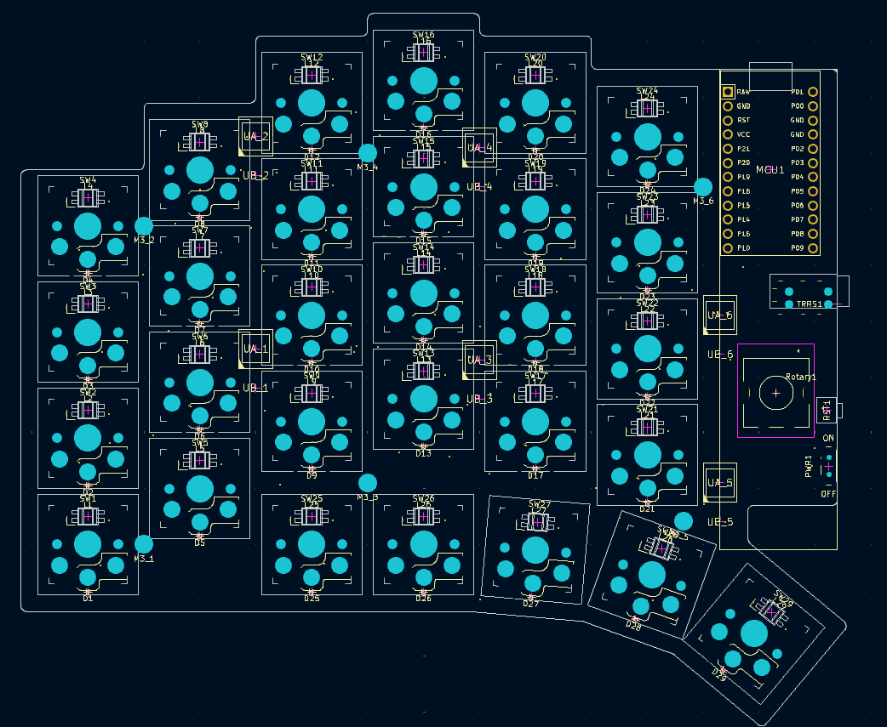

# boost58_kb
 
This layout was given this name because its shape looks similar to the boost arrows in racetrack video games.

# Introduction
I designed this board because I couldn't find any options that fit my requirements for a custom key board, which were:
1. completely reversible circuit board (for a split keyboard)
2. two-way UART communication between the two halves
3. compatible with Kailh Choch v2 switches (with v1 backward compatability)
4. hotswap switch sockets
5. staggered column layout (including a stagger for the outer-pinky column, and inner-index column)
6. 4 finger rows, plus only one thumb row
7. per-key and underglow RGB lights
8. anti-ghosting diodes
9.  promicro-style MCU
10. at least 1 rotary encoder per-side
11. reset button
12. power switch (optional)

I designed this with the intention of making it my dream keyboard, but also available and accessible to others. I am open to suggestions and PR's.

# Build Progress

## v0.2
### Top Layout v0.2

## v0.1

### Original Top Layout

# Thanks
Thanks to:
[ergogen](https://github.com/ergogen/ergogen) for the base software to be able to create this.
[ceoloide](https://github.com/ceoloide/ergogen-footprints) for the footprints and examples
[benvallack](https://github.com/benvallack) for the inspiration that started my custom keyboard journey and the `promicro_pretty` footprint (it's amazing).

# Buy Me a Coffee
[@Vacant0mens](https://buymeacoffee.com/vacan0mens)
